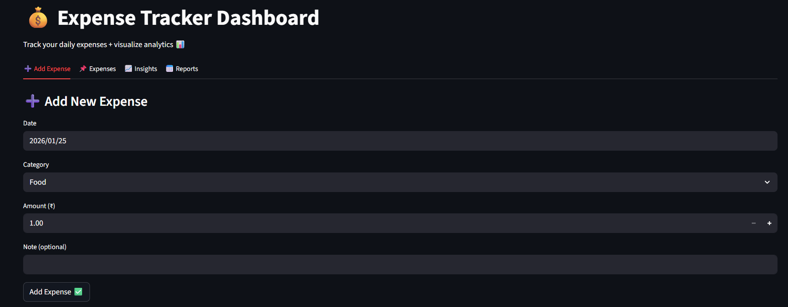

## 🌐 Live Demo
https://expense-tracker-dashboard-fh6xzcij4xs3rsg37it56h.streamlit.app

# 💰 Expense Tracker Dashboard (Python + Streamlit)

A simple and interactive Expense Tracker web app built using **Python + Streamlit** to track daily expenses and visualize spending analytics.

## 🚀 Features
- Add daily expenses (date, category, amount, note)
- Store expenses in CSV file
- Filter expenses by category and month
- Summary metrics (Total, Average, Transactions)
- Category-wise spending analytics (Pie chart)
- Daily spending trend (Line chart)
- Monthly report + Top 5 highest expenses
- Download filtered expenses as CSV

## 🛠 Tech Stack
- Python
- Streamlit
- Pandas
- Plotly

## 📸 Screenshots



## ▶️ Run Locally
```bash
pip install -r requirements.txt
streamlit run app.py
